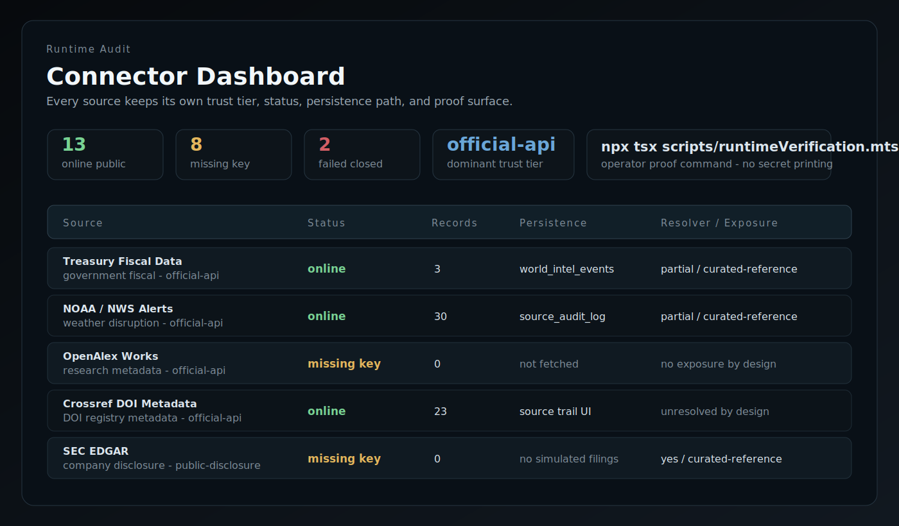
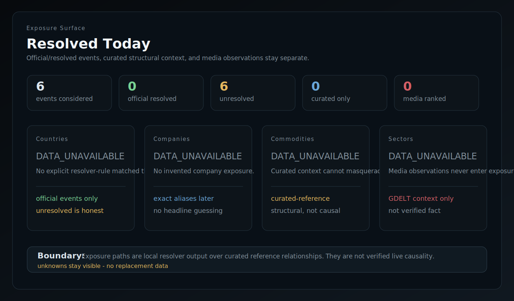
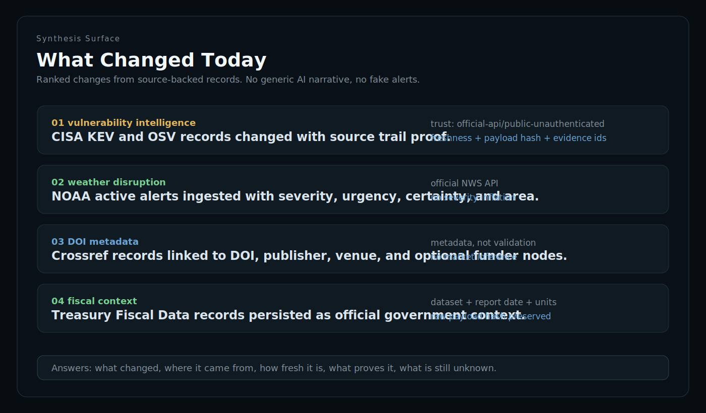
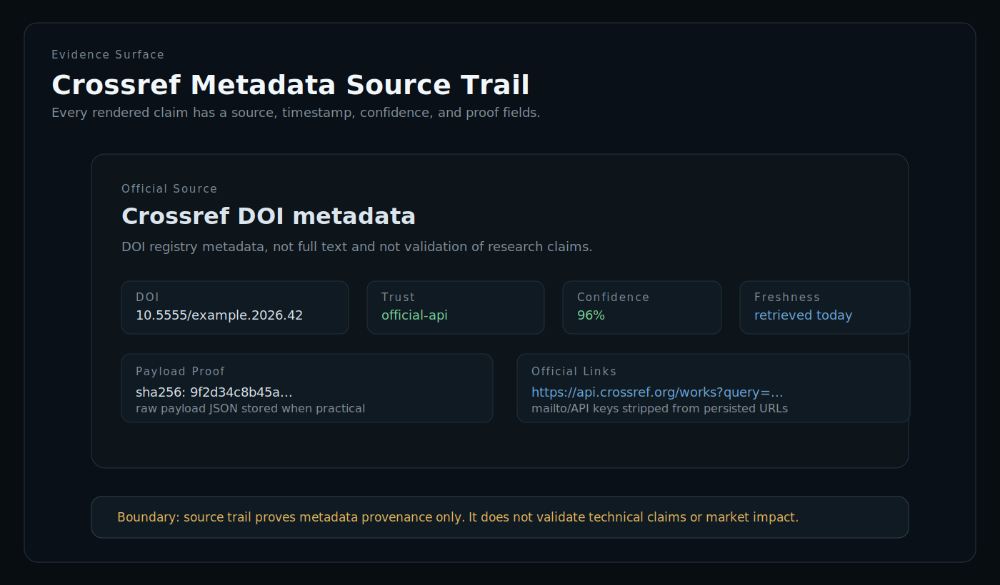
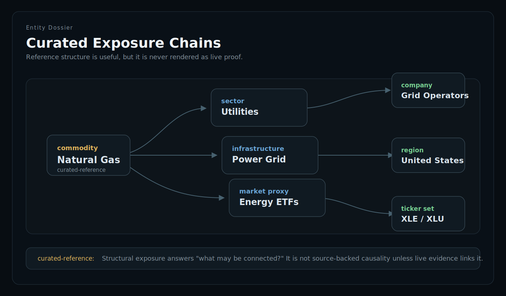

# Atlasz Intel

<p align="center">
  
</p>

<p align="center">
  <strong>Atlasz Intel is a local-first real-source intelligence terminal that turns official/public data into source-trailed events, evidence graphs, and structural exposure context.</strong>
</p>

<p align="center">
  <a href="https://github.com/gryszzz/Atlasz-Intel/releases/latest">Latest release</a>
  |
  <a href="docs/runtime-verification-log.md">Runtime verification log</a>
  |
  <a href="docs/intelligence-source-atlas.md">Source atlas</a>
  |
  <a href="docs/atlasz-runtime-engineering-standards.md">Engineering standards</a>
</p>

Atlasz is not a chatbot, news clone, trading bot, or placeholder dashboard. It is a local desktop intelligence workspace for asking: what changed, where did it come from, what proves it, which entities does it touch, and what is still unknown?

## What Atlasz Answers

- What changed today?
- Where did it come from?
- How fresh is it?
- What proves it?
- What entities does it touch?
- What structural exposure exists?
- What is unknown?

## Real Data Contract

Atlasz is allowed to be incomplete. It is not allowed to fake intelligence.

- No simulated replacement data.
- No fake events, fake alerts, fake macro data, fake filings, fake patents, fake sanctions, or fake weather.
- Missing keys show `missing-key` or `missing-config`.
- Failed, stale, malformed, unavailable, and rate-limited sources fail closed.
- Media observations are not verified facts.
- Curated exposure is structural context, not live proof.
- Public unauthenticated data is labeled as public unauthenticated.
- Local-derived and model-inferred outputs never become verified by UI wording.
- Source trails require source identity, timestamp/freshness, confidence, provenance, URL when available, and payload proof when practical.
- Secrets are read from environment only and must not appear in source trails, logs, raw payload JSON, or UI endpoint lists.

## Interface Preview

These repo-owned images show the public-facing Atlasz surfaces and the evidence boundaries they enforce.

| Connector Dashboard | Exposure Dashboard |
| --- | --- |
|  |  |

| What Changed Today | Source Trail Card |
| --- | --- |
|  |  |

| Curated Exposure Chains |
| --- |
|  |

## Architecture Loop

```text
connectors
  -> normalize
  -> persist
  -> source trail
  -> Evidence Graph
  -> resolver
  -> curated exposure
  -> dashboards
  -> verification log
```

Runtime flow:

- Official/public connectors fetch bounded records with retry/backoff and fail-closed guards.
- Adapters normalize records into stable internal types with source identity and payload hashes.
- Local persistence stores source-backed records, audit rows, source trails, and graph evidence.
- The Evidence Graph links source records to entities, topics, publishers, companies, countries, sectors, commodities, vulnerabilities, filings, patents, and events when proof fields exist.
- Resolver output can surface curated structural exposure, but it is labeled `curated-reference` and never upgraded into live causality.
- Dashboards show source health, stale/missing-key states, ranked changes, source trails, entity dossiers, and unresolved gaps.
- `scripts/runtimeVerification.mts` drives the real registry and writes an auditable truth table.

## Connector Matrix

Runtime-wired means Atlasz has an adapter/provider path, tests, source health behavior, and UI/persistence wiring. It does not mean every source is reachable without keys on every machine.

| Connector | Domain | Public/key-gated | Trust tier | Runtime status | Source trail | Persistence | Exposure/resolver behavior |
| --- | --- | --- | --- | --- | --- | --- | --- |
| Public market REST | markets/watchlist | public | public-unauthenticated | default live-capable | Data Core | sampled market state | price context only, not advice |
| Public crypto websockets | crypto ticks | public opt-in | public-unauthenticated | live-capable when enabled | Data Core | sampled frames/ticks | local-computed proxy pressure only |
| Market Reference Master | ticker/CIK/legal identity | public | official-api | live-capable | Market identity trail | `market_identity_master` | exact ticker/CIK/name resolver, no fake sectors |
| ETF holdings | basket constituents | public | public-disclosure | live-capable | ETF holdings trail | holding events/audit | dated issuer snapshot, source-provided weights only |
| GDELT DOC | media observation | public | media-observation | live-capable, may fail closed | GDELT trail | world events/audit | no exposure ranking, no verified event claim |
| Treasury Fiscal Data | government fiscal | public | official-api | live-capable | Treasury trail | macro/fiscal records | partial macro/fiscal context |
| BLS | labor/economic | public | official-api | live-capable | BLS trail | macro observations | partial macro context |
| NOAA/NWS alerts | weather disruption | public | official-api | live-capable | NOAA weather trail | weather events/audit | partial region resolver, unresolved is allowed |
| USGS earthquakes | geophysical events | public | official-api | live-capable | USGS trail | world events/audit | partial region resolver |
| Federal Register | policy/regulatory | public | official-api | live-capable | regulatory trail | policy events/audit | partial agency/policy resolver |
| OFAC SDN | sanctions/enforcement | public | official-api | live-capable | OFAC trail | sanctions events/audit | identifier-only, no inferred guilt/risk |
| GitHub Releases | OSS technology | public, optional token | public-unauthenticated | live-capable | GitHub release trail | release events/audit | configured repo/entity resolver |
| CISA KEV | exploited vulnerabilities | public | official-api | live-capable | KEV trail | cyber events/audit | partial CVE/product context |
| NVD | vulnerabilities | public | official-api | live-capable, may rate-limit/fail closed | NVD trail | cyber events/audit | partial CVE/product context |
| GHSA | security advisories | public | public-unauthenticated | live-capable | GHSA trail | cyber events/audit | partial package/CVE context |
| OSV | open-source vulnerabilities | public | official-api | live-capable | OSV trail | cyber events/audit | partial package/CVE context |
| CISA advisories | defensive security | public | official-api | live-capable | advisory trail | cyber events/audit | partial product/vendor context |
| Crossref DOI metadata | research metadata | public | official-api | live-capable | Crossref trail | DOI metadata/audit | DOI/publisher/venue/funder graph only |
| SEC EDGAR | company disclosure | user-agent gated | public-disclosure | `missing-key` until `ATLASZ_SEC_USER_AGENT` | SEC filing trail | filings/events/audit | company/ticker/entity resolver |
| SEC 13F holdings | institutional holdings | user-agent gated | public-disclosure | `missing-key` until `ATLASZ_SEC_USER_AGENT` | SEC 13F trail | holding events/audit | delayed quarterly snapshot, exact CUSIP→ticker only |
| FRED | macro time series | key-gated | official-api | `missing-key` until `ATLASZ_FRED_API_KEY` | FRED trail | macro series/observations | partial macro context |
| BEA | national accounts/GDP | key-gated | official-api | `missing-key` until `ATLASZ_BEA_API_KEY` | BEA trail | macro observations | partial macro context |
| EIA | energy/commodities | key-gated | official-api | `missing-key` until `ATLASZ_EIA_API_KEY` | EIA trail | energy records/audit | commodity/energy resolver |
| Congress.gov | legislation | key-gated | official-api | `missing-key` until `ATLASZ_CONGRESS_API_KEY` | Congress trail | bill/action events | identifier/policy resolver |
| UN Comtrade | trade flows | key-gated | official-api | `missing-key` until `ATLASZ_UN_COMTRADE_API_KEY` | Comtrade trail | trade records/audit | no company exposure by design |
| USPTO PatentsView | patent intelligence | key-gated | official-api | `missing-key` until `ATLASZ_PATENTSVIEW_API_KEY` | USPTO trail | patent records/audit | assignee/classification resolver |
| OpenAlex Works | research graph metadata | key-gated | official-api | `missing-key` until `ATLASZ_OPENALEX_API_KEY` | OpenAlex trail | research records/audit | topic/institution graph only |

## Live, Key-Gated, Media, Curated, Future

**Live public**

Market Reference Master via SEC company_tickers.json, Treasury Fiscal Data, BLS, NOAA/NWS alerts, USGS earthquakes, Federal Register, OFAC SDN, GitHub Releases, CISA KEV, NVD, GHSA, OSV, CISA advisories, Crossref DOI metadata, GDELT media observation, Yahoo/CoinGecko public market paths, and optional public crypto websocket paths.

**Key-gated or config-gated**

SEC EDGAR, SEC Company Facts/Form 4/Form 13F, FRED, BEA, EIA, Congress.gov, UN Comtrade, USPTO PatentsView, OpenAlex Works, operator-provided public disclosure JSON, optional GitHub token, and optional local Ollama parsing.

**Media-observation**

GDELT is treated as media observation. It can show that something was observed in public media metadata; it is not a verified event and does not enter exposure ranking.

**Curated-reference**

Curated exposure chains describe structural relationships such as company -> sector -> commodity -> region. They are useful context, but they are not live proof that a specific event caused a specific impact.

**Future/not implemented**

Crossref is now runtime-wired. Still future or reference-only: richer GKG/media entities, OpenCTI/MISP/Yeti integrations, World Bank/IMF connectors, aviation/ADS-B, shipping/AIS, OpenStreetMap/geography surfaces, NASA/earth observation, premium news providers, broader BEA/BLS/EIA expansions, and semantic/vector matching.

## Operator Verification

Run:

```bash
npx tsx scripts/runtimeVerification.mts
```

This command:

- drives the real provider registry and adapter code
- checks public connectors live where reachable
- reports keyed connectors without keys as `missing-key`
- verifies fail-closed boundaries and source trust labels
- scans normalized output for secret leakage
- writes `docs/runtime-verification-log.md`
- prints environment key names only, never secret values

Latest checked state in this repo:

```text
npm run lint
npm run build
npm test
git diff --check
npx tsx scripts/runtimeVerification.mts
```

The current verification log is the source of truth for what was online, failed closed, or missing-key on the last operator run.

## What It Does

- High-density local desktop command center.
- Connector Dashboard for source health, trust tier, stale/rate-limited/missing-key state, record count, persistence, and source trail coverage.
- Exposure Dashboard for resolved events, unresolved gaps, media-observation boundaries, and curated-reference exposure counts.
- What Changed Today ranking across source-backed filings, macro records, weather, policy, cyber, research metadata, fiscal data, patents, OSS releases, and trade/fiscal layers as configured.
- Evidence Graph linking events, entities, topics, publishers, countries, companies, sectors, commodities, vulnerabilities, filings, patents, and sources.
- Entity dossiers with timelines, proof rows, unknowns, source links, freshness, confidence, and curated exposure chains.
- Local SQLite WAL persistence with JSON fallback.
- Worker-thread realtime market ingestion and browser fallback store.
- Decision Journal and research-note surfaces for local operator context.
- Ctrl/Cmd + K command menu for navigation and inspection.

## Boundaries

Atlasz Intel is informational research software.

- Not financial advice.
- Not legal advice.
- Not a sanctions screening tool.
- Not a trading bot.
- Not a broker, execution engine, smart order router, or price oracle.
- Not true Level 2 order-book depth unless a real depth connector is added later.
- Not OSINT targeting people.
- No scraping private/personal data.
- No bypassing authentication, paywalls, CAPTCHAs, or rate limits.
- No offensive security automation.
- No guarantee that public unauthenticated data is complete, fresh, or verified.

## Install

```bash
git clone https://github.com/gryszzz/Atlasz-Intel.git
cd Atlasz-Intel
npm install
```

## Run Locally

```bash
npm run dev
```

Browser-only preview:

```bash
npm run web:dev
```

With no `.env`, Atlasz starts with safe defaults: public/no-auth paths may run, key-gated providers show missing-key, unavailable data stays unavailable, and simulator/dev data must be explicitly enabled and labeled.

## Configuration

Copy `.env.example` to `.env` only when you want to opt in to external public feeds, keyed official APIs, or local model experiments.

Common examples:

```bash
ATLASZ_ENABLE_PUBLIC_WORLD=1
ATLASZ_SEC_USER_AGENT="Atlasz Intel research (you@example.com)"
ATLASZ_FRED_API_KEY="..."
ATLASZ_EIA_API_KEY="..."
ATLASZ_OPENALEX_API_KEY="..."
ATLASZ_CROSSREF_MAILTO="you@example.com"
```

Never commit `.env`, generated local databases, logs, caches, or local API keys.

## Validate

```bash
npm run lint
npm run build
npm test
git diff --check
npx tsx scripts/runtimeVerification.mts
```

Desktop packaging is available when Electron packaging dependencies and host platform requirements are satisfied:

```bash
npm run desktop:build
```

## Source Atlas And Private Skills

The OSINT, security, agent, UI, data-engineering, and systems-design corpora are reference material unless promoted through the provider registry, adapter tests, source health, persistence, and UI evidence path.

Private Codex/Claude skills are operator-private agent instructions. They are not Atlasz runtime, not required for a public checkout, and should not be treated as source connectors. Repo docs may describe the engineering doctrine; private skills belong in the user/agent skill system.

## Release Hygiene

Release assets should exclude `node_modules`, `.env`, generated databases, logs, caches, local screenshots with secrets, and untracked Electron output unless a desktop package is explicitly produced.

Public repo target:

```text
https://github.com/gryszzz/Atlasz-Intel
```
