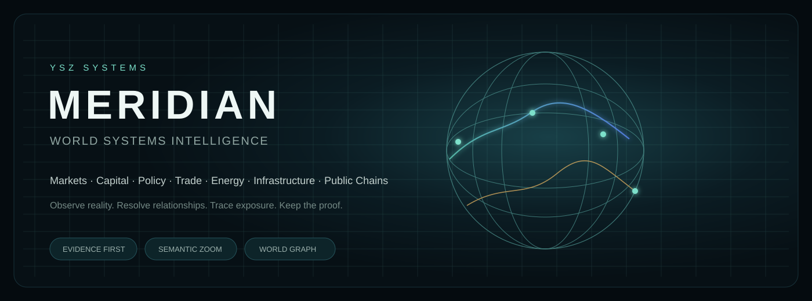
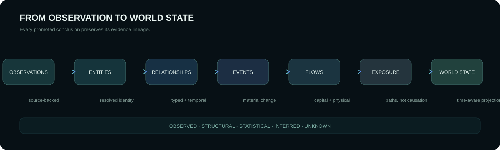
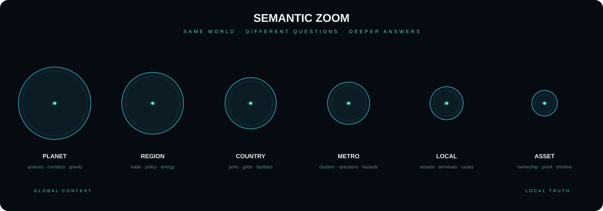
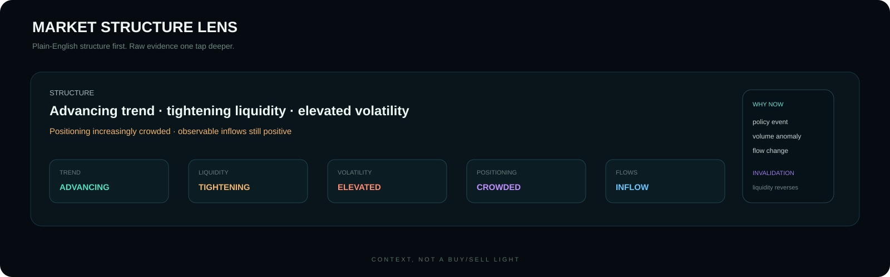
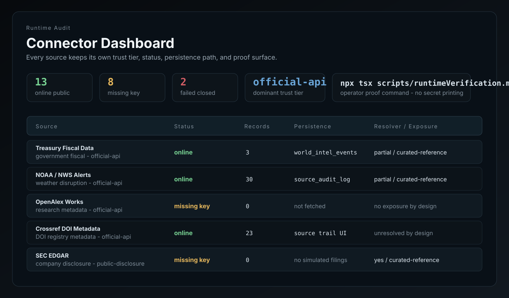
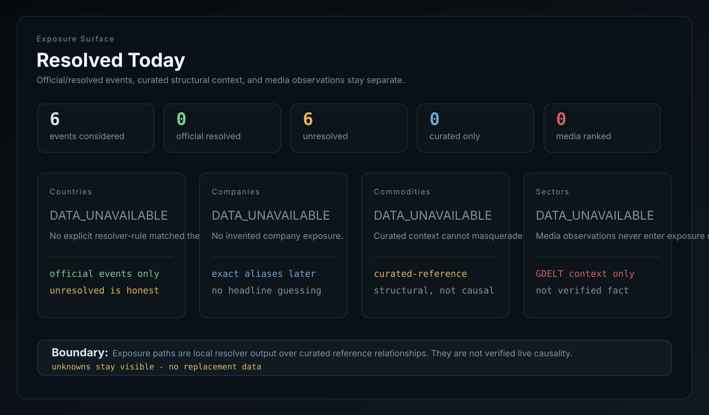
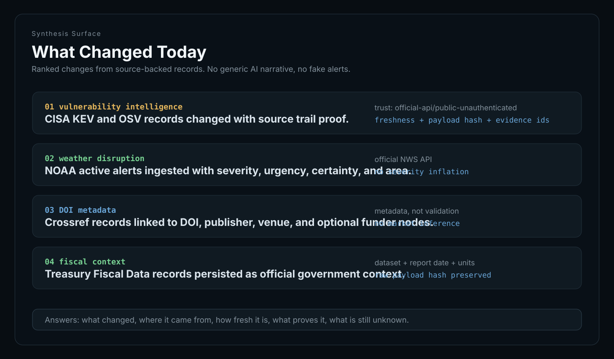
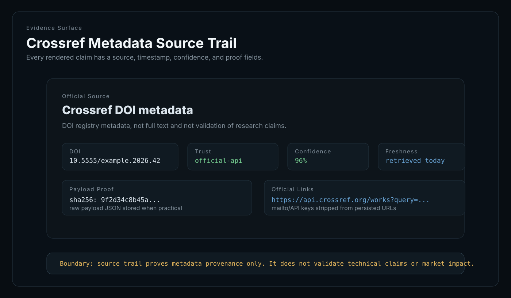
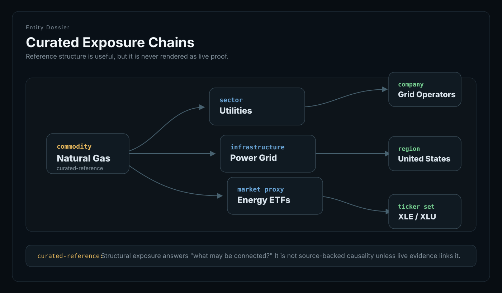

<div align="center">



# YSZ // MERIDIAN

### World systems intelligence with receipts.

**A geospatial intelligence engine for understanding how markets, capital, policy, trade, energy, infrastructure, public blockchains, cyber events, and the physical world connect and change over time.**

[**Open Meridian →**](https://gryszzz.github.io/Atlasz-Intel/) · [Architecture](docs/atlasz-world-rebuild.md) · [Semantic zoom](docs/semantic-zoom.md) · [Runtime verification](docs/runtime-verification-log.md)

</div>

---

Meridian is built around one question:

> **What changed, where did it happen, what systems does it touch, how material is it, and what proves it?**

It is not a pile of dashboards. It is a temporal world graph backed by source trails. Observations resolve into entities and relationships; relationships form flows and exposures; events update a time-aware world state.



### One world model, multiple lenses

| Lens | Meridian reveals |
| --- | --- |
| **World** | material events, regions, systemic change, uncertainty |
| **Markets** | structure, volatility, liquidity, positioning, observed reaction |
| **Capital** | institutional ownership, funds, insiders, financing, concentration |
| **Trade** | commodities, bilateral flows, ports, chokepoints, route dependencies |
| **Energy** | generation, grids, oil, gas, LNG, nuclear, storage and refineries |
| **Infrastructure** | facilities, operators, dependencies, industrial clusters |
| **Policy** | documented regulation, sanctions, tariffs, fiscal and central-bank actions |
| **Chain** | public-chain transfers, exchange-associated flows, bridges and treasuries |
| **Risk** | physical hazards, cyber exposure, conflicts, contradictions and unknowns |

### Zoom changes what Meridian knows how to show

The globe is not decoration. Meridian's semantic zoom progressively changes the information model from global systems to individual assets.



At planet scale, local noise disappears. At country scale, ports, grids and strategic facilities emerge. At metro/local scale, facilities, vessels, routes and operators become inspectable. At asset scale, the interface can pivot into ownership, market exposure, evidence and timeline.

### The intelligence loop

```text
SOURCE
  │
  ▼
OBSERVATION ──► ENTITY RESOLUTION ──► RELATIONSHIP GRAPH
                                           │
                                           ▼
                                  EVENT / FLOW / EXPOSURE
                                           │
                   ┌───────────────────────┼──────────────────────┐
                   ▼                       ▼                      ▼
              GEOSPATIAL              MARKET                 BLOCKCHAIN
                STATE                STRUCTURE                  STATE
                   └───────────────────────┬──────────────────────┘
                                           ▼
                                     WORLD BRIEF
                                           │
                                           ▼
                                  PROOF + UNKNOWNS
```

**Meridian separates four things that ordinary dashboards blur together:** what was directly observed, what is structurally connected, what is statistically unusual, and what is inferred. Unknown stays a valid state.

---

## The Real-Data Contract

This is the core of the product, not a footnote. Meridian is *allowed to be incomplete*. It is *not allowed to fabricate intelligence*.

- **No simulated production data.** No fake events, alerts, macro prints, filings, patents, sanctions, prices, or weather.
- **Fail closed, always.** Failed, stale, malformed, unavailable, or rate-limited sources surface as exactly that — never as silently-substituted data.
- **Missing keys are honest.** Key-gated providers render `missing-key` / `DATA_UNAVAILABLE` until configured. There is no random-walk price fallback.
- **Provenance or it didn't happen.** Source trails carry source identity, freshness, confidence, provenance, a URL when available, and payload proof when practical.
- **Media is observation, not fact.** GDELT shows what public media *metadata* observed — it never becomes a verified event and never enters exposure ranking.
- **Curated structure is reference, not causality.** Exposure chains describe relationships; they are labeled `curated-reference` and are never upgraded into live proof.
- **Secrets stay secret.** Keys are read from the environment only and must never appear in source trails, logs, raw payloads, or UI endpoint lists. A redaction scan enforces it.

---

## What's New in v0.2.0

The terminal grew from a connector dashboard into a full reasoning surface. Highlights since the last README:

### Aegis Worldwatch Profiles
Profile-aware watchlists rank intelligence by the systems you care about: tickers,
companies/CIKs, ETFs, commodities, regions, facilities, ports, grid regions,
minerals, CVEs, connectors, and themes. Hermes delivers evidence, Aegis evaluates
trust/freshness/conflict, and Worldwatch only ranks relevance. Watchlists never
create evidence or raise truth confidence.

### Local API Activation
`docs/local-api-setup.md` and `scripts/checkRuntimeConfig.mts` give operators a
safe key activation path: env-name presence only, official-host validation for
configured URLs, and locked connector summaries. The UI now includes a Connector
Activation Panel for missing-key, configured, online, failed, rate-limited, and
stale states without rendering key values.

### Intelligence Synthesis — "What To Watch Next"
The forward end of the evidence chain. Meridian composes briefs that walk:
`observed change → proof → resolved entities → curated systems → corroboration → conflicts → unknowns → what it does NOT prove → confirmation-seeking watch items` — **every line basis-labeled** so you always know whether you're reading evidence, structure, or inference.

### Cross-Source Corroboration & Conflict Detection
- **Corroboration** rewards independent overlap across sources — media never counts as corroboration, and stale sources are downgraded.
- **Conflict detection** flags contradictions instead of silently merging them: ticker↔CIK, CIK↔name, facility coordinates, ETF ticker↔CUSIP, and operator-identity mismatches.

### Canonical Freshness Model
One freshness vocabulary across the whole app: `live · fresh · cached · stale · expired · missing-key · unavailable · rate-limited`. **"What Changed Today"** now excludes static/annual reference data unless it was genuinely change-tracked today.

### Geospatial + Energy / Trade / Materials Core
A real geospatial layer with energy, logistics, and critical-materials connectors: EIA **power plants, refineries, LNG terminals, nuclear plants**, **NRC reactor status**, **grid regions / balancing authorities**, **ports (UN/LOCODE + World Port Index)**, **USGS minerals**, and a curated **critical-minerals crosswalk**.

### Real Market Data (no fake prices)
A key-gated equity/ETF **quote provider (Alpaca)** wired live into the ingestion worker, plus an **options chain / open-interest** provider. Seeded/default market surfaces are gated out of production — it's `PRICE_UNAVAILABLE` until a real quote arrives, never a guess.

### Honesty Harness
A self-auditing spine: Connector Dashboard, Market Coverage Dashboard, Market Data Reality audit, the [Connector Super-Hardening audit](docs/connector-hardening-audit.md), and an upgraded [runtime verification pass](docs/runtime-verification-log.md) reporting freshest/oldest record, coverage, eligibility, and corroboration/conflict counts.

---

## Interface

Meridian is designed as a **map-first world-systems operating surface**: calm at global scale, progressively deeper as the operator zooms into regions, infrastructure, markets, entities, and evidence.



The product surface follows the same visual language as the world model:

- **World view** — material change, flows, systemic gravity, uncertainty.
- **Semantic zoom** — planet → region → country → metro → local → asset.
- **Market structure** — trend, liquidity, volatility, positioning, flows, event exposure.
- **Entity / ownership graph** — companies, funds, facilities, operators, dependencies.
- **Proof layer** — source trail, timestamps, freshness, contradictions, unknowns.

<details>
<summary><strong>Technical evidence-surface previews</strong></summary>

<br/>

| Connector Dashboard | Exposure Dashboard |
| --- | --- |
|  |  |

| What Changed Today | Source Trail Card |
| --- | --- |
|  |  |

| Curated Exposure Chains |
| --- |
|  |

</details>

---

## Architecture Loop

```text
 connectors ─▶ normalize ─▶ persist ─▶ source trail ─▶ Evidence Graph ─▶ resolver
                                                                            │
   verification log ◀── dashboards ◀── intelligence synthesis ◀── curated exposure
```

**Runtime flow**

1. **Connectors** fetch bounded records from official/public sources with retry, backoff, and fail-closed guards.
2. **Adapters** normalize records into stable internal types carrying source identity and payload hashes.
3. **Persistence** stores source-backed records, audit rows, source trails, and graph evidence in local SQLite (WAL) with a JSON fallback.
4. The **Evidence Graph** links records to entities, topics, publishers, companies, countries, sectors, commodities, vulnerabilities, filings, patents, facilities, and events — only when proof fields exist.
5. The **resolver** can surface curated structural exposure, labeled `curated-reference`, never upgraded into live causality.
6. **Corroboration & conflict** passes cross-check sources before anything is presented as agreement.
7. **Intelligence synthesis** composes basis-labeled "What To Watch Next" briefs.
8. **Dashboards** show source health, freshness state, ranked change, source trails, entity dossiers, and unresolved gaps.
9. `scripts/runtimeVerification.mts` drives the real registry and writes an auditable truth table.

---

## Connector Matrix

**48 runtime-driven connectors.** *Runtime-wired* means there is an adapter/provider path, tests, source-health behavior, and UI/persistence wiring — not that every source is reachable without keys on every machine. The live, generated table lives in [`docs/runtime-verification-log.md`](docs/runtime-verification-log.md).

### Live public — fetch live, no key required
SEC Market Reference Master · ETF Holdings · FRED CSV · Treasury Fiscal Data · BLS · EIA public bulk reference · Federal Register · Congress.gov *(DEMO_KEY mode)* · OFAC SDN · NOAA/NWS Alerts · USGS Earthquakes · CISA KEV · CISA Advisories · NVD · GHSA · OSV · GitHub Releases · OpenAlex Works · Crossref DOI · UN/LOCODE · NRC Reactor Status · World Port Index · USGS Minerals *(MRDS legacy reference)* · arXiv/GitHub/NASA/Space public feeds · GDELT *(media observation)* · Yahoo/CoinGecko public market paths · optional public crypto websockets

### Key-gated — require `.env`, fail closed to `missing-key`
SEC EDGAR · SEC Company Facts · SEC Form 4 · SEC Form 13F *(SEC User-Agent)* · BEA · EIA authenticated API *(+ power plants / nuclear / grid)* · UN Comtrade · USPTO PatentsView · Alpaca equity/ETF quotes · Alpaca options chain/open-interest

### Configured official URLs — no fake facility layers
LNG terminals · EIA refineries require pinned official URLs unless a trusted default is configured. Missing URLs render as configured-only / missing-key states, not fabricated map markers.

### Domain coverage at a glance

| Domain | Connectors |
| --- | --- |
| **Markets & identity** | Market Reference Master, Equity/ETF Quotes, ETF Holdings, Options chain/OI |
| **Company disclosure** | SEC EDGAR, Company Facts, Form 4 (insiders), Form 13F (institutions) |
| **Macro & fiscal** | FRED, BEA, BLS, Treasury Fiscal Data |
| **Policy & regulatory** | Federal Register, Congress.gov, OFAC SDN |
| **Cyber & vulnerabilities** | CISA KEV, CISA Advisories, NVD, GHSA, OSV |
| **Energy & facilities** | EIA, EIA Power/Nuclear Plants, Refineries, LNG Terminals, NRC Reactor Status, Grid Regions |
| **Trade, ports & materials** | UN Comtrade, UN/LOCODE, World Port Index, USGS Minerals |
| **Physical world** | USGS Earthquakes, NOAA/NWS Alerts |
| **Research & IP** | USPTO PatentsView, OpenAlex Works, Crossref DOI |
| **OSS & media** | GitHub Releases, GDELT *(media observation)* |

---

## What It Does

- **High-density local command center** — a desktop workspace, not a web tab.
- **Connector Dashboard** — source health, trust tier, freshness state, record counts, persistence, and source-trail coverage.
- **Connector Activation Panel** — local key/config presence and what each connector unlocks, without exposing values.
- **Exposure Dashboard** — resolved events, unresolved gaps, media-observation boundaries, and curated-reference exposure counts.
- **Market Coverage Dashboard + Market Data Reality panel** — honest gaps where real quotes don't exist yet.
- **Aegis Worldwatch Profiles** — relevance profiles and watchlist chips for what matters to your systems without changing proof or confidence.
- **What Changed Today** — ranked change across filings, macro, weather, policy, cyber, research, fiscal, patents, OSS releases, and trade layers.
- **What To Watch Next** — forward-looking, basis-labeled intelligence briefs.
- **Evidence Graph + Entity Dossiers** — timelines, proof rows, unknowns, source links, freshness, confidence, and curated exposure chains.
- **World globe + event timeline** — geospatial context for physical-world and facility events.
- **Quant terminal, Decision Journal, and research notes** — local operator context.
- **`Ctrl/Cmd + K` command palette** — navigation and inspection from the keyboard.

---

## Tech Stack

| Layer | Choice |
| --- | --- |
| Shell | **Electron 42** (desktop) with a browser-only preview mode |
| UI | **React 19** + TypeScript, Tailwind v4, Recharts, `@xyflow/react` graph |
| Build | **Vite 8**, `vite-plugin-electron`, `tsc` project references |
| Persistence | **SQLite (WAL)** via `better-sqlite3`, with a JSON fallback store |
| Ingestion | Worker-thread realtime market ingestion + browser fallback store |
| Verification | `scripts/runtimeVerification.mts` (real registry, fail-closed, redaction scan) |

---

## Quickstart

```bash
git clone https://github.com/gryszzz/Atlasz-Intel.git
cd Atlasz-Intel
npm install
npm run dev          # desktop (Electron) dev
```

Browser-only preview:

```bash
npm run web:dev
```

Production web build:

```bash
npm run web:build
```

### GitHub Pages

The public Meridian surface is designed to deploy from `main` to:

**https://gryszzz.github.io/Atlasz-Intel/**

The Pages workflow builds in web mode with the repository base path, uploads `dist/`, and deploys through GitHub Pages. Electron remains a separate desktop runtime.

The deployment workflow requests Pages enablement automatically. If organization/repository policy blocks API enablement, enable **Settings → Pages → Build and deployment → Source → GitHub Actions** once.

With no `.env`, Meridian starts on safe defaults: public/no-auth paths may run, key-gated providers report `missing-key`, unavailable data stays unavailable, and any simulator/dev data must be explicitly enabled **and** labeled.

### Configuration

Copy `.env.example` to `.env` only to opt into external public feeds, keyed official APIs, or local model experiments.

```bash
ATLASZ_ENABLE_PUBLIC_WORLD=1
# Background Worldwatch refresh loop; due providers still respect their own
# source cadence/rate guards.
ATLASZ_WORLD_REFRESH_MS=600000
ATLASZ_SEC_USER_AGENT="Meridian Intel research (you@example.com)"
ATLASZ_EIA_API_KEY="..."
# No-key EIA public bulk reference is enabled by default; this key is still
# required for authenticated EIA API/facility/grid coverage.
# Optional quota upgrades, not required for baseline:
ATLASZ_FRED_API_KEY="..."
ATLASZ_OPENALEX_API_KEY="..."
ATLASZ_CONGRESS_API_KEY="..."
ATLASZ_CROSSREF_MAILTO="you@example.com"
# Real market data (no fake prices):
ATLASZ_ALPACA_API_KEY="..."
ATLASZ_ALPACA_SECRET_KEY="..."
```

> Never commit `.env`, generated local databases, logs, caches, or local API keys.

---

## Operator Verification

The verification pass is the source of truth for what was online, failed closed, or missing-key on the last run.

```bash
npx tsx scripts/runtimeVerification.mts
```

It drives the **real** provider registry and adapter code: public connectors are exercised live where reachable, keyed connectors without keys report `missing-key`, and keyed connectors with keys do a real fetch. It verifies fail-closed boundaries and trust labels, scans normalized output for secret leakage, prints **environment key names only — never values**, and writes [`docs/runtime-verification-log.md`](docs/runtime-verification-log.md).

Full local gate:

```bash
npm run lint
npm run build
npm test
git diff --check
npx tsx scripts/runtimeVerification.mts
```

Desktop packaging (when Electron build deps and host requirements are satisfied):

```bash
npm run desktop:build
```

---

## Boundaries

YSZ Meridian is **informational research software**. It is:

- **Not** financial, legal, or sanctions-screening advice.
- **Not** a trading bot, broker, execution engine, smart order router, or price oracle.
- **Not** true Level-2 order-book depth unless a real depth connector is added later.
- **Not** OSINT targeting people — no scraping of private/personal data.
- **Not** a tool for bypassing authentication, paywalls, CAPTCHAs, or rate limits, and **not** for offensive security automation.

Public unauthenticated data carries no guarantee of completeness, freshness, or verification — and Meridian labels it as such.

---

## Source Atlas & Private Skills

The OSINT, security, agent, UI, data-engineering, and systems-design corpora in `docs/` are **reference material** unless promoted through the full evidence path: provider registry → adapter tests → source health → persistence → UI.

Private Codex/Claude skills are operator-private agent instructions. They are **not** Meridian runtime, not required for a public checkout, and not source connectors. The repo docs may describe the engineering doctrine; private skills live in the user/agent skill system.

## Release Hygiene

Release assets exclude `node_modules`, `.env`, generated databases, logs, caches, local screenshots containing secrets, and untracked Electron output unless a desktop package is explicitly produced.

<div align="center">
<br/>
<sub>Public repo · <a href="https://github.com/gryszzz/Atlasz-Intel">github.com/gryszzz/Meridian-Intel</a> · Real data only.</sub>
</div>
